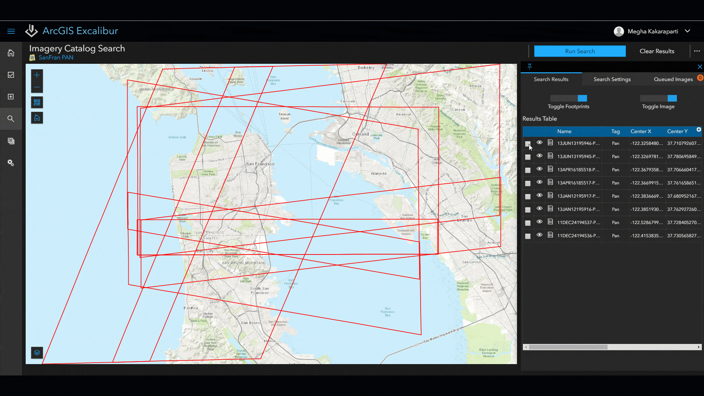
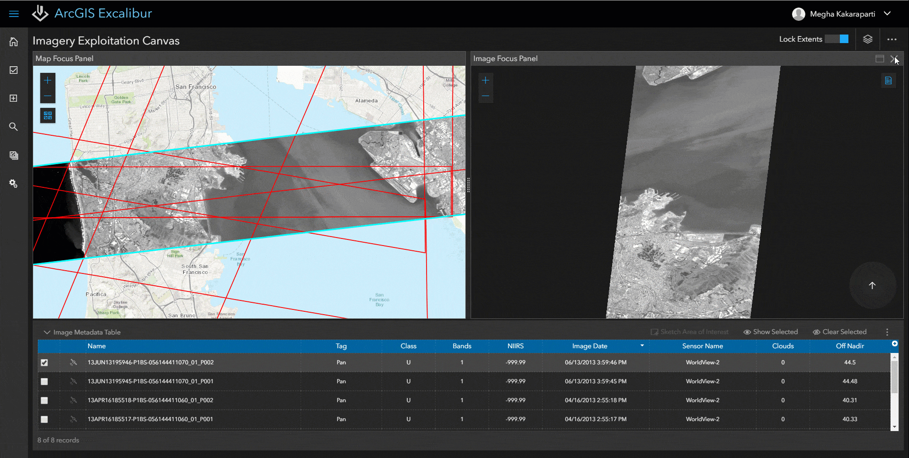
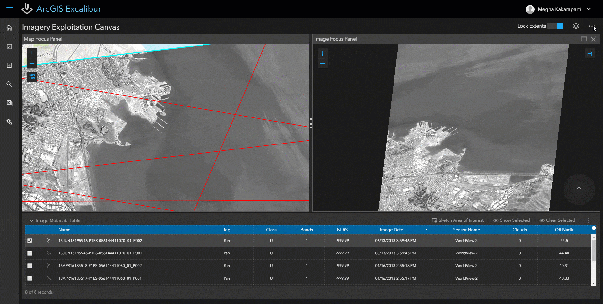
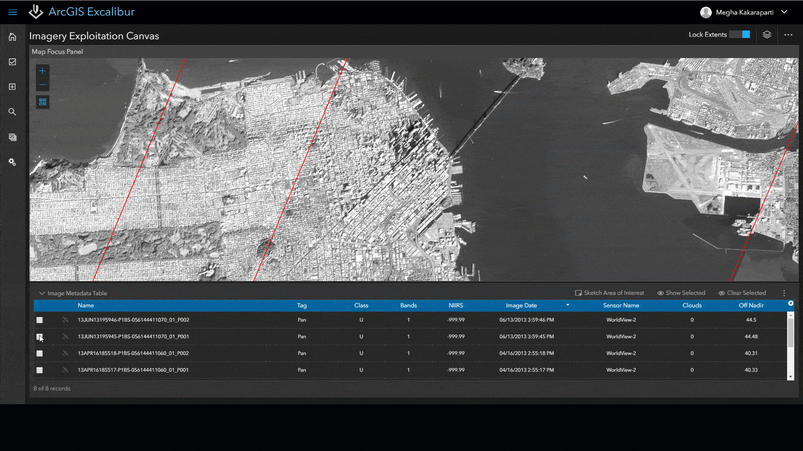

# Geospatial Intelligence & Its Application
**GEOINT**, short for geospatial intelligence, is a term first introduced in 2005 by a geospatial intelligence defense agency within the U.S. government. Similar to Artificial Intelligence (AI), which focuses on the mining of computational machine intelligence, GEOINT has a concentrated interest in the experiment and development of geospatial data and mapping intelligence. Some of its functionality and practical usage includes, but not limited to, "the analysis of literal imagery; geospatial data; and information technically derived from the processing, exploitation, literal, and non-literal analysis of spectral, spatial, and temporal fused products." ([learn more](https://www.omnisci.com/technical-glossary/geoint)) GEOINT also works closely with the usage of electro-optical, synthetic aperture radar (SAR) and related sensor programs to aid the data collection process, which requires the collection of stationary and moving targets for the data types mentioned above.

In April 2019, ESRI announced its first release of ArcGIS Excalibur (ArcGIS Excalibur 1.0). It is introduced as a web-based image exploitation workflow for timely geospatial intelligence. And to provide services for intuitive design to work with imagery and reference data in a project-based experience. ([learn more](https://www.youtube.com/watch?v=wtAFXG-sG7g)) The results are shared in dynamic information products across the organization Although, this was not the first web-map application ESRI has created, what allowed Excalibur to stand out is its premium functionality in imagery acquisition and integration of Geospatial Intelligence concepts. Excalibur is described as the "next generation front-end web experience to search, discover, and work with imagery". ([learn more](https://www.esri.com/arcgis-blog/products/excalibur/imagery/visit-the-arcgis-excalibur-team-at-the-geoint-symposium-2019/)) While metadata concerns about the data about the data, Excalibur concerns about the mapping of a map. Just like its description, one of the major functionalities of Excalibur is that it allows ArcGIS Enterprise, ArcGIS Image Server and other ArcGIS technologies to work with national and commercial sensors for on-the-fly processing and visualization of imagery and rasters collections.
(insert image here)

In an assigned reading that was given to us several weeks ago, it talked about a concept called **data journalism**. I think the usage of Excalibur follows closely along the guidelines of this. In laymen terms, data journalism is able to present people with a broader perspective of how one views data. Another concept that is introduced by Excalibur is **imagery project**, it concerns about the imagery workflow streamline by leveraging the ArcGIS platform. An ArcGIS Excalibur imagery project is a dynamic way to organize resources, tools, and workflows required to complete an image-based task. The geospatial reference layers can be manipulated by the set of tools for focused image analysis and structured observation management workflows within the imagery project. Users are also able to create contents that can be shared and made available to leverage in downstream analysis and shared information products through imagery project.

The Excalibur application is truly made for anyone's usage, well, definitely for anyone's usage in the technical field. No matter if you work in the GIS field, software development field, cloud management or work as a data analyst, imagery specialist and even just a person interested in technology. ArcGIS Excalibur provides services to discover, analyst, and report information derived from imagery analysis or exploitation.

### Major functionalities & Work Flow:

**1. Imagery Searching**
  - Given who you are or your organization, Excalibur is able to quickly filter out relating imageries through the provide criteria. A user is able to connect  directly to an imagery layer, an image service URL, or even through the **imagery catalog search**. It also allows users to search for other areas of interest to discover and queue images for future use.
  

**2. Working With Imagery**
  - Once the users have chosen the area of interest, they will be prompted to connect to the **imagery exploitation canvas** where they can utilize a wide variety of tools to begin working with the imagery. Excalibur allows users to view imagery on top of a default basemmap, which is an orthorectified and aligned projection of the area, at the same time the exploitation canvas will enable users to view the same image in a more focused manner as it was captured in its native perspective.
  

**3. Displaying**
  - Excalibur will automatically optimise imagery to get the most value out of each image pixel. Users can also choose to change the settings under the **display tools** tab. The display tools also include functionalities like image renderers, filters, the ability to change band combinations, change image transparency/compression and even apply settings like DRA and gamma.
  

**4. Exploitation of Tools**
  - It is very easy to work with the chosen image area as well. Under the **mark up tools**, users are able to mark up, label and make measurements. There are several different options in doing this, users can choose to create simple graphics on top of their imagery by using text and shape elements to call attention. Some examples are outline, fill and transparency. The sub **measurements tool** tab allows users to measure horizontal and vertical distances, areas, and feature locations on an image.
  

**5. Exporting**
  - After users have finished all of their analysis, the finished product can be simply shared using the **export tools**. The **create presentation tool** is a shortcut that allows user to save the image to a Microsoft PowerPoint presentation, along with the metadata of the imagery.

**Below I have listed summarizations of ArcGIS Excalibur and its application in 5 different areas**

**Image Management**
- Search and discover interactively
- High accessibility to imagery through trials
- Personal settings to define search categories for refined discovery results

**Exploitation**
- Immediate processing and dynamic visualization of current events
- Integrate and portray side-by-side visualization to fully project oblique and orthorectified imagery
- Image annotation and sketching with automatic, accurate transformation to geographic features

**Imagery Project**
- Dynamic, focused workflows to organize and accomplish image-based tasks
- Leverage existing web maps containing reference layers for contextual use in imagery project
- Streamline object collection management workflows
- Temporally analyze project layers to improve situational awareness

**Imagery Derived Products**
- Create products for interactive briefings
- Utilize dynamic analysis layers for use in additional platform applications
- Enable temporal monitoring of observations
- Perform traceability of analytical assessments

**Personal User Settings**
- System notifications to proactivity report information
- Configurable user preference settings provide the best experiences when using the application
- System administrators not required to set and manage personal preferences

### ArcGIS Excalibur In Real Life:
ArcGIS Excalibur is being used in a crucial area--national security. And like any national security programs, it is given a high degree of jurisdiction to access people's private life. The satellite imagery used in Excalibur are captured and examined on-the-fly to in response to immediate events. For example, if someone within an area reports a crisis, the captured image would be able to send back the immediate image of the area, which includes both private and public property. These images would be used for analysis that are done without the authorization of the residents. Although the images are not used in any mean of profit gain. Its implication is still worth thinking about. It is the capability of such strong analysis ability of certain, if not the whole globe, that strikes people to tie national security to individual privacy protection.

Citations:

1. <cite>[Albert Einstein][1]</cite>
2.

[1]: http://www.quotedb.com/quotes/2112
